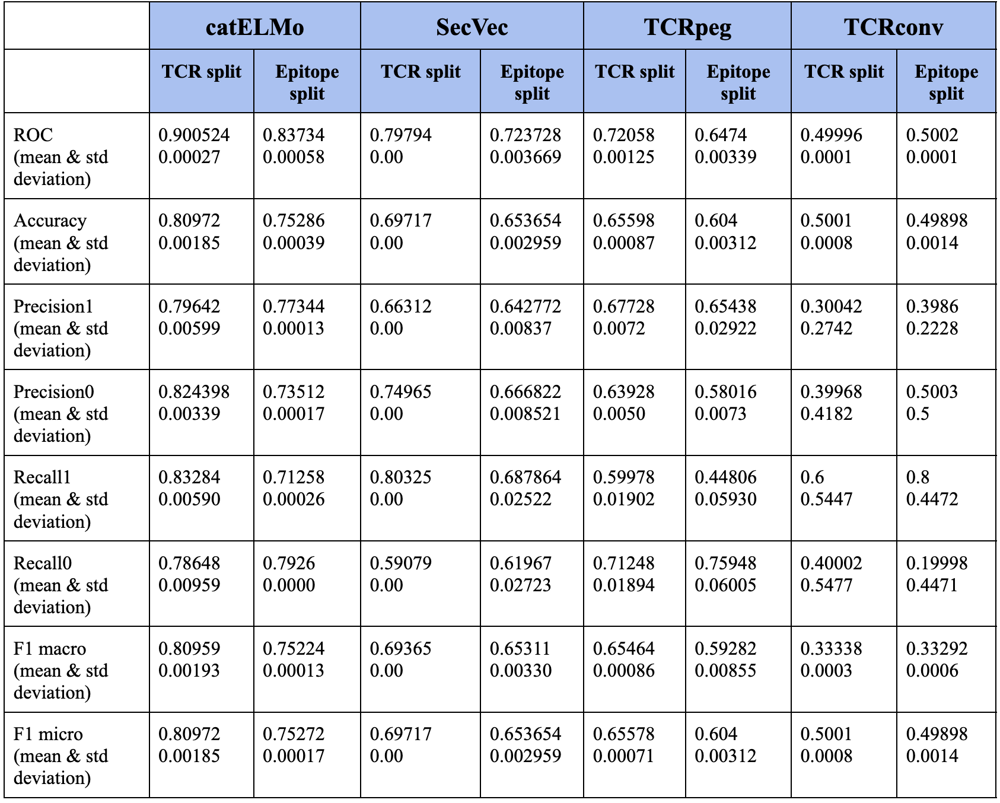

# Benchmark-Amino-acid-Embedding-models-and-TCR-Epitope-Binding-Affinity-Prediction
This project employs machine learning methods to address a binary classification problem in biology – predicting the binding affinity between TCR and epitope sequences. The baseline model used is "catELMo" [1]. The main objectives are: 
- Benchmarking catELMo against other amino acid embedding models (seqvec [2], TCRconv [3], TCRpeg [4]). The goal is to identify the most effective amino acid embedding model for the subsequent binary classification task.
- Proposing and developing a binary classification model for predicting the binding status (binding or non-binding) for the given amino acids (TCR & Epitope).

The data consists of about 4 million records of TCR and Epitope sequences (TCREpitopePairs.csv)[5] along with their labels for supervised learning. The data for the prediction model is generated by embedding models in pickle format.

## Amino acid embedding models
For each of the 4 model results demonstrated below, we have used pre-trained models (with given weights and options) on the dataset TCREpitopePairs.csv, and completed 5 runs each for “TCR split” and “Epitope split”. The screenshots for all these results are available in the "baseline_results" folder.
The performance metrics are calculated as the mean and standard deviation from the above results are as shown-

Based on the scores in the above table, we can observe that catELMo shows the best results on baseline, compared to the other three models. A review of the code for these models revealed that catELMo is bidirectional and contextualized, which means that it can capture more contextual information compared to other embeddings like TCRpeg which uses positional embedding and TCRconv which uses a BERT based model for embedding. Understanding the contextual meaning of words or sequences is very important for the given problem of finding embeddings for TCR and Epitopes. This is the reason that the model SeqVec, which also understands context, but is unidirectional, performs as the second best among the given models.

## Binding Affinity Prediction Model : Baseline
To establish a baseline for comparison, our project uses a pre-defined baseline model, as provided in the official GitHub repository for catELMo. We did not make any changes to the architecture of the baseline model, composed of linearly connected layers.
The detailed results of the baseline prediction model for all the 4 embedding vector pickle files has already been demonstrated above. Each model ran 5 times each on TCR split and Epitope split and the screenshots displaying the performance metrics for each of these runs have been added into the baseline_results folder.

# Proposed Prediction Model
This project proposes 4 models to perform the prediction task:
- Random Forest classifier- It captures complex relationships between data through an ensemble of decision trees. Hence, for TCR-epitope binding prediction, the diverse, non-linear interactions between amino acid sequences can be modeled effectively.
- Support Vector Machine- It is effective in high-dimensional spaces and can efficiently create hyperplanes to distinguish binding from non-binding instances.
- XGBoost- It is a gradient boosting model and can handle missing data well, which aligns with the challenges presented by biological sequence datasets.
- Neural Network with Attention Mechanism- It can capture complex dependencies within sequences. Attention mechanisms help focus on specific regions of input sequences, and so TCR-epitope binding can be understood better.
  
It was decided to go with the Random Forest model as it is an ensemble method which can capture complex data well and it is less prone to overfitting.
As observed in the results from the previous section, the catELMo embedding produces the best results when run through the baseline prediction, out of all the 4 models chosen. Hence, catELMo embedding is  used for the proposed prediction model on Random Forest. Also, since SeqVec embedding produced results which were close to catELMo and is the second best model, the SecVec embedding is also used for Random Forest prediction. The results have been generated separately for TCR split (5 times) and Epitope split (5 times) for both these embedding models. The mean and standard deviation for these results have been demonstrated in the table below:

We can observe that the prediction results using catELMo embedding gives an accuracy of 0.7225 (tcr split), 0.6929 (epitope split). This is less accurate than the catELMo + baseline model which has accuracy of 0.80972 (tcr split), 0.75286 (epitope split). However, the result is slightly better than the SeqVec + baseline (as well as tcrpeg+baseline and tcrconv+baseline) which has accuracy of 0.69717 (tcr split), 0.653654 (epitope split). We can conclude that catELMo is highly effective in capturing the context of the sequences provided. However, SeqVec + Random Forest performed better than SeqVec + baseline, suggesting that while the latter captures sequential information, it may have limitations in representing highly complex and non-linear interactions, which can be captured well in a Random Forest model. 

References-

[1] catELMo: https://github.com/Lee-CBG/catELMo/tree/main 

[2] SeqVec: https://github.com/mheinzinger/SeqVec 

[3] TCRconv: https://github.com/emmijokinen/TCRconv   

[4] TCRpeg: https://github.com/jiangdada1221/TCRpeg 

[5] Datasets: https://github.com/Lee-CBG/catELMo/tree/main/datasets 

